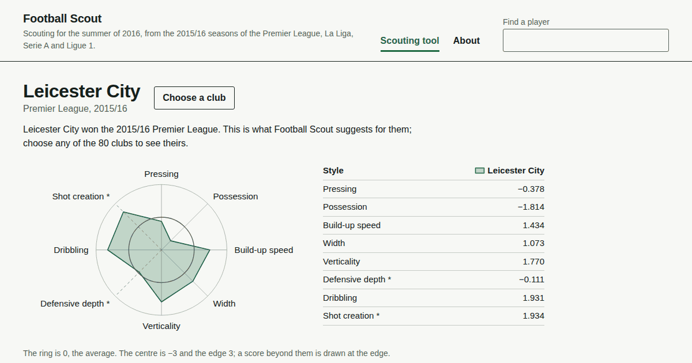

# Football Scout

Football Scout is a scouting tool for the 2015/16 season of four leagues: the Premier League, La Liga, Serie A and Ligue 1. Choose a club and it does what a recruitment team could have done in the summer of 2016: find players whose output looks high for their price, find players who play like one of the club's own, and plan the signings that would raise the club's side most within a budget.

**Site:** https://abhigyanrathi.github.io/football-scout/

[](https://abhigyanrathi.github.io/football-scout/)

It covers the 1,247 outfield players who played at least 900 minutes for one club that season, 1,166 of them with a market valuation, and the 80 clubs of the four leagues. Each main claim had a pass rule, written down before its result was computed, and every result is reported here, whether it passed or not.

## What was tested

Figures in brackets are 95% intervals over 2,000 redraws of the teams, with each league's 20 teams drawn with replacement.

| Claim | Pass rule | Result | Verdict |
|---|---|---|---|
| Shrunk values from the first 23 matchdays predict a player's output over the last 15 better than his raw values | Upper end of the interval for the squared-error ratio, shrunk over raw, below 1 | Interval 0.197 to 0.748 | Passed |
| Players with higher gem scores in the summer of 2016 gained more market value over the next year than players like them | Lower end of the interval for the correlation above 0 | 0.066 (0.007 to 0.125) | Passed, narrowly |
| A player's style over the first 23 matchdays picks him out from his teammates in the same position over the last 15 | Lower end of the interval for the gain over chance above 0 | 621 of 863 players, where chance gives 324: a gain of 0.344 (0.316 to 0.372) | Passed |
| Adding a player's fit with his club's style improves the model that predicts his value | The model with fit has the smaller error in at least 1,950 of 2,000 redraws | 1,193 of 2,000 | Not passed |
| Squads picked with shrunk values do better than squads picked with raw values | Higher summed output over the last 15 matchdays in at least 1,950 of 2,000 redraws at €35 million, with €15 million and €90 million judged the same way | 1,339, 1,154 and 1,085 of 2,000 | Not passed at any budget |
| Network embeddings improve the style search | Lower end of the interval for the gain in mean reciprocal rank above 0 | 0.016 (−0.002 to 0.036) | Not passed, so left out |

Reported beside the tests, with no rule:

- Market momentum, a player's price over his valuation a year earlier, did better than the gem score, at 0.196 (0.131 to 0.259), so the site shows it in a column of its own.
- Among the cheaper half of the players the gem score's correlation was 0.050 (−0.026 to 0.128), and among the dearer half 0.121 (0.020 to 0.215).
- Of the 117 players with the highest gem scores, 17 were valued at one and a half times their price or more a year later, against 152 of all 1,166.
- At the main budget the shrunk pick beat 9,988 of 10,000 random squads. A €40 million squad picked this way in the summer of 2016 was valued at 1.083 times its cost a year later, above 5,765 of 10,000 random squads at that budget.
- In the ablation, five nested models each add one family of inputs: basic numbers, the shrunk value, style, style fit and the embeddings. None beat the model before it, the first being compared with the league average, in 1,950 of 2,000 redraws: the counts were 1,911, 1,941, 1,663, 1,193 and 747.

## How it works

1. **Data.** StatsBomb's open event data for the four leagues' 2015/16 seasons, converted to actions with socceraction. Minutes come from the match lineups. Market valuations and transfers come from Transfermarkt, through the transfermarkt-datasets project, and StatsBomb players are matched to them by name within the matched club and season.
2. **A forward split.** Each league splits after matchday 23. Models learn from matchdays 1 to 23 and are judged on 24 to 38. Leaving out one league at a time is the second split.
3. **Action values.** A player's value is what his actions on the ball were worth per 90 minutes, measured with VAEP, which credits each action by how much it changed his side's chances of scoring and of conceding. The two classifiers behind it, xgboost on socceraction's default features, are fitted five times on matchdays 1 to 23: once on all four leagues and once with each league left out, so no value used as a target comes from a model that saw it. Their probabilities are then recalibrated for each model, league and outcome.
4. **Shrinkage.** A Fay-Herriot model, a form of empirical Bayes, shrinks each player's value toward what is usual for players of his position, league and playing time, and shrinks it more the noisier his estimate is.
5. **Style.** A player's style is eight scores: pressing, possession, build-up speed, width, verticality, defensive depth, dribbling and shot creation, each measured against players of his position in his league. Each club has the same eight, measured against the clubs of its league.
6. **Player network.** Teammates are linked when one passes to the other or when they press together, and a two-layer GraphSAGE network turns each player's place in that graph into 16 numbers.
7. **Ablation.** Five nested ElasticNet models of a player's later output, each adding one family of inputs, measure what each family adds.
8. **Hidden gems.** A player's gem score is how far his full-season shrunk value lies above that of players of his price, age, league and position: his residual from a regression of value on those.
9. **Upgrade plans.** Integer programs, solved exactly with SciPy's milp, pick the signings that raise a club's summed value most within a budget, keeping the club's own shape: how its season minutes split across positions. Each club has 30 plans, at budgets from €5 million to €80 million and with up to three signings.
10. **Fit and replacements.** A player's fit to a club is a weighted mean of the products of his eight style scores and the club's. The replacement search ranks other clubs' players in the same position by style distance, and the site marks as within the noise any match that is as close to the player as he is to himself across two halves of a season.
11. **The site.** Python writes the published tables to `web/data`, and rebuilding from the same tables gives the same bytes. The pages are plain HTML, CSS and JavaScript, with no framework, no build step and no requests to other sites. A GitHub Actions workflow, with its actions pinned to commits, publishes `web/`.

## How the results were checked

- **Rules first.** Each test's design and pass rule were entered in `docs/decisions.md`, dated, and committed before its result was computed. Corrections are recorded as entries of their own.
- **Whole teams redrawn.** Uncertainty comes from a bootstrap that redraws teams, 20 per league, 2,000 times. Teammates share opponents, a schedule and a way of playing, so redrawing players would make the intervals too narrow. The rating models are held fixed in the redraws, so the intervals are conditional on them.
- **No leakage.** A value used as a target never comes from a model that trained on it.
- **Tests.** pytest for the pipeline, where the tests that read the local data are marked slow; Node tests for the site's logic; static checks of the pages; a check of the workflow's pinned actions; and ruff.

## What's where

- `src/fbrecruit/`: the pipeline, a module per stage. Most run as `python -m fbrecruit.<module> <step>`.
- `tests/`: pytest for the pipeline and Node tests for the site.
- `web/`: the site, with its data in `web/data`.
- `docs/decisions.md`: every design choice, pass rule and result, dated.

## Running it

It needs Python 3.12 and was developed on Windows with 16 GB of RAM.

```
python -m venv .venv
.venv\Scripts\activate                      # Linux and macOS: source .venv/bin/activate
pip install -e ".[ml,dev]"
```

On Linux, run `pip install torch==2.12.1 --index-url https://download.pytorch.org/whl/cpu` before the last of these lines. Otherwise pip takes torch's CUDA build from PyPI, which with the GPU libraries it pulls in is about 2.7 GB of the install's 3.3 GB of downloads; nothing here uses a GPU. On macOS, PyPI has torch 2.12.1 only for Apple silicon on macOS 14 or later.

The steps run in this order, each reading files written by steps before it:

```
# data
python -m fbrecruit.sources.statsbomb       # StatsBomb open data, four leagues, 2015/16
python -m fbrecruit.sources.transfermarkt   # the transfermarkt-datasets tables
python -m fbrecruit.minutes statsbomb       # minutes from the match lineups
python -m fbrecruit.links.teams             # StatsBomb clubs to Transfermarkt clubs
python -m fbrecruit.links.statsbomb_tm      # and players, by name within club and season

# action values
python -m fbrecruit.actionvalue features LEAGUE
python -m fbrecruit.actionvalue fit
python -m fbrecruit.actionvalue predict
python -m fbrecruit.actionvalue tables

# recalibration, at depth 6 and then at depth 3, whose values the rest use
python -m fbrecruit.calibration folds
python -m fbrecruit.calibration fit K LABEL
python -m fbrecruit.calibration predict
python -m fbrecruit.calibration calibrate
python -m fbrecruit.calibration tables
python -m fbrecruit.calibration fit3 K LABEL
python -m fbrecruit.calibration predict3
python -m fbrecruit.calibration fit3full NAME LABEL
python -m fbrecruit.calibration predict3full NAME
python -m fbrecruit.calibration adopt

# shrinkage
python -m fbrecruit.shrinkage groups
python -m fbrecruit.shrinkage dispersion
python -m fbrecruit.shrinkage fit
python -m fbrecruit.shrinkage evaluate
python -m fbrecruit.shrinkage bootstrap

# style and the player network
python -m fbrecruit.style pressures         # downloads the events again, for their pressures
python -m fbrecruit.style profiles
python -m fbrecruit.graph links
python -m fbrecruit.graph embed

# ablation
python -m fbrecruit.ablation inputs
python -m fbrecruit.ablation fit
python -m fbrecruit.ablation bootstrap
python -m fbrecruit.ablation verdicts

# squads
python -m fbrecruit.squad pool
python -m fbrecruit.squad full
python -m fbrecruit.squad redraws
python -m fbrecruit.squad tally

# hidden gems
python -m fbrecruit.gems value
python -m fbrecruit.gems prices
python -m fbrecruit.gems scores
python -m fbrecruit.gems outcomes
python -m fbrecruit.gems test
python -m fbrecruit.gems squads

# style over the last 15 matchdays, and the identification test
python -m fbrecruit.style window2
python -m fbrecruit.graph window2
python -m fbrecruit.identify test

# full-season style, fit and replacements
python -m fbrecruit.style season
python -m fbrecruit.scout tools
```

A step written with `LEAGUE`, `K`, `LABEL` or `NAME` is run once for every value of each, each run in a process of its own: `LEAGUE` is `la_liga`, `premier_league`, `serie_a` and `ligue_1`; `K` is 0 to 4; `LABEL` is `scores` and `concedes`; `NAME` is `pooled_d3` and `lolo_LEAGUE_d3` for each `LEAGUE`.

Each step was run, and its outputs checked, when it was built; the whole chain has not been rerun from scratch in one go.

The results above come from `shrinkage bootstrap` (shrunk against raw values), `gems test` (gem scores, market momentum, the cheaper and dearer halves and the 117 highest gem scores), `identify test` (style identification and the network embeddings), `ablation verdicts` (style fit and the ablation), `squad tally` (the squad test), `squad full` (the random squads at the main budget) and `gems squads` (the €40 million squad). From `shrinkage` on, a step prints to two logs in `data/logs` instead of the screen: one in full and one of its key lines. The modules' other steps print checks, and figures that `docs/decisions.md` reports beside the results; each runs the same way once the files it reads exist, and `scout beside` also reads the log of `identify test`.

Everything the steps write goes under `data/`, which git ignores. The Wyscout loaders and player links and the transfer cohorts in `src/fbrecruit` are kept for a later out-of-sample check; nothing published uses them.

To rebuild the site's data and look at it locally:

```
python -m fbrecruit.web build
python -m http.server --directory web       # then open http://localhost:8000/
```

Tests:

```
python -m pytest                            # all of them; a slow test skips when its data isn't there
python -m pytest -m "not slow"              # the tests that don't read the data
node --test tests/js/core.test.mjs
python -m ruff check .
```

## Limitations

- One season and four leagues, and only outfield players with at least 900 minutes for one club.
- Values are measured against each player's league level, so a plan that moves a player between leagues assumes his output carries over.
- The ranges beside values and plan gains are 90% intervals of the noise in each player's estimate, nothing more.
- Prices are Transfermarkt valuations, not fees, and the site shows them in seven bands.
- The gem score's test passed narrowly, and among the cheaper half of the players its interval includes zero.
- Style fit is a search preference and nothing more, and plans are suggestions, not forecasts.
- A club's shape is how its minutes split across positions, rounded to ten places. It is not a formation, and a few shapes are artifacts of the rounding.
- One year later is hindsight that a buyer in the summer of 2016 did not have.

## Where it came from

Football Scout began as a college group project, System-Aware Football Recruitment, which we presented to our supervisor. Its code was lost, so I rebuilt it from the presentation: the aims are the original's, parts of the design are reworked, and every number here was computed afresh. None comes from the original presentation.

## Data and credits

<picture>
  <source media="(prefers-color-scheme: dark)" srcset="web/assets/hudl-statsbomb-logo-reversed.png">
  
</picture>

- Event data: [StatsBomb open data](https://github.com/statsbomb/open-data), used under the StatsBomb Public Data User Agreement.
- Market valuations and transfers: Transfermarkt, through [transfermarkt-datasets](https://github.com/dcaribou/transfermarkt-datasets).
- Actions and action values: [socceraction](https://github.com/ML-KULeuven/socceraction)'s SPADL and VAEP.

Built by Abhigyan Rathi as a non-commercial project.

## Licence

The code is under the [MIT License](LICENSE). The data files in `web/data` and the figures in `docs/decisions.md` come from StatsBomb and Transfermarkt data. They are not covered by that licence and stay under those sources' terms.
